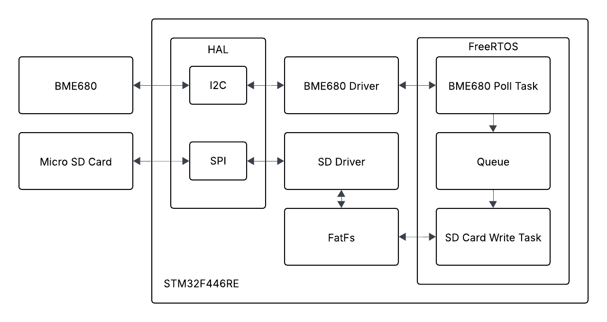
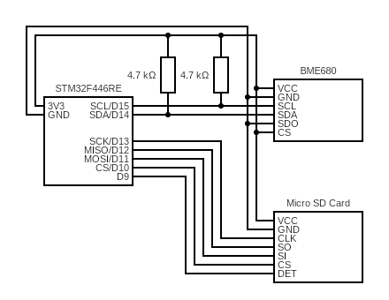

# Environmental-Data-Logger

### Description
This project implements a real-time environmental data logger using an STM32 Nucleo-F446RE microcontroller, a BME680 environmental sensor, and a microSD card for storage. The system runs on FreeRTOS, featuring a custom I²C driver for the BME680.

## Overview

This system records humidity, temperature, air pressure, and gas resistance from
the BME680, on a configurable interval, and writes the data to a micro sd card
in this CSV format:

time (seconds), humidity (% * 100,000), temperature (centigrade),
pressure (pascals), gas resistance (ohms)

### Config

In include/config.h, `configBME680_POLL_INTERVAL` controls the time 
(in milliseconds) between each poll of the BME680, and,
`configSD_FILE_NAME` controls the name of the file the output data is written
to.

## Hardware Components
### NUCLEO-64 STM32F446RE EVAL BRD
**Description:**
STM32 Nucleo-64 development board with STM32F446RE MCU  
**Manufacturer:**
STMicroelectronics  
**Product Number:**
NUCLEO-F446RE  
**Voltage:**
VDD 1.7V - 3.6V, VDDIO 1.7V-3.6V  
**Interface:**
GPIO, I2C, SPI, UART  
**Documentation:**
[Product Page](https://www.digikey.com/en/products/detail/stmicroelectronics/NUCLEO-F446RE/5347712)    [Datasheet](https://www.st.com/content/ccc/resource/technical/document/datasheet/65/cb/75/50/53/d6/48/24/DM00141306.pdf/files/DM00141306.pdf/jcr:content/translations/en.DM00141306.pdf)    [Databrief](https://www.st.com/content/ccc/resource/technical/document/data_brief/c8/3c/30/f7/d6/08/4a/26/DM00105918.pdf/files/DM00105918.pdf/jcr:content/translations/en.DM00105918.pdf)    [Website](https://www.st.com/en/evaluation-tools/nucleo-f446re.html?ecmp=tt9470_gl_link_feb2019&rt=db&id=DB2196#overview)  

### BME680-BREAKOUT BOARD
**Description:**
Humidity, pressure, temperature and air quality sensor  
**Manufacturer:**
Watterott Electronic GmbH  
**Product Number:**
201878  
**Voltage:**
VDD 1.71V - 3.6V, VDDIO 1.2V - 3.6V  
**Interface:**
I2C, SPI  
**Documentation:**
[Product Page](https://www.digikey.com/en/products/detail/watterott-electronic-gmbh/201878/10071156)    [Datasheet](https://www.bosch-sensortec.com/media/boschsensortec/downloads/datasheets/bst-bme680-ds001.pdf)    [Databrief](https://mm.digikey.com/Volume0/opasdata/d220001/medias/docus/567/201878_Web.pdf)  

### MICROSD SPI/SPIO BREAKOUT BOARD
**Description:**
Breakout board connects microSD slot to pins for SPI/SPIO  
**Manufacturer:**
Adafruit Industries LLC  
**Product Number:**
4682  
**Voltage:**
VDD 3.3V (delicate)  
**Interface:**
SPI, SPIO  
**Documentation:**
[Product Page](https://www.digikey.com/en/products/detail/adafruit-industries-llc/4682/12822319)    [Datasheet](https://cdn-learn.adafruit.com/downloads/pdf/adafruit-microsd-spi-sdio.pdf)  

##  Dependencies
**FreeRTOS** v202406.01-LTS  
Real-time operating system for tasks, queues, and synchronization

**FatFS** R0.16  
File system library providing FAT32 support for SD card storage

**STM32CubeF4** 1.28.3  
STM32 configuration tool for initializing peripherals and middleware

**STM32 HAL drivers** v1.8.5  
Vendor-provided abstraction layer for STM32 Boards

## Block Diagram

  

## Circuit Diagram

  

##  FreeRTOS Task Layout:
- **BME680 Poll Task**
  - Initializes BME680
  - Loop:
    - Poll BME680
	- Collect timestamp
	- Send output data to queue
- **SD Card Write Task**
  - Initializes SD Card
  - Loop:
	- Waits on queue for output data
	- Writes output data to SD Card
